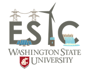

### 1. Graduate Research Assistant (Aug. 2020 - Present) 

  
  Washington State University, Pullman, WA

### 2. Graduate Research Intern (May 2020 - Aug. 2020) 

  
Energy Systems Innovation Center, Pullman, WA

### 3. Graduate Research Assistant (May 2019 - May 2020) 

  
South Dakota State University, Brookings, SD 

### 4. Graduate Teaching Assistant (Aug. 2018 - May 2019) 

  
South Dakota State University, Brookings, SD 

### 5. Electrical Engineer (May 2017 - Jul. 2019) 
Upendra Badal International, Kathmandu, Nepal

